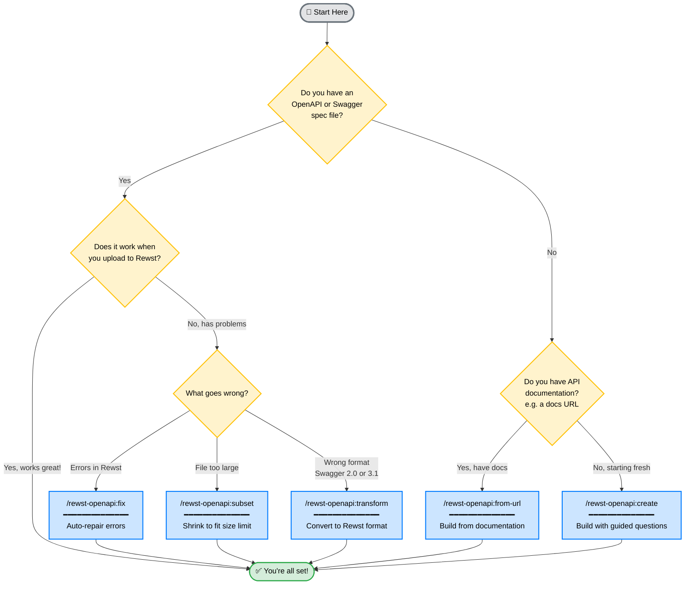

# Claude Rewst Integration Factory

A Claude Code plugin that helps you create custom integrations for [Rewst](https://rewst.io/) - even if you've never worked with APIs before.

## What This Does

Rewst lets you connect to any API using "Custom Integrations." To create one, you need an OpenAPI spec (a file that describes the API). This plugin helps you:

- **Create** specs from scratch or from documentation
- **Fix** specs that have errors
- **Validate** specs before uploading to Rewst

## Prerequisites: Install Claude Code

This plugin runs inside **Claude Code**, Anthropic's AI coding assistant. If you don't have it yet, follow the steps for your operating system:

### macOS

1. **Install Homebrew** (if you don't have it):
   ```bash
   /bin/bash -c "$(curl -fsSL https://raw.githubusercontent.com/Homebrew/install/HEAD/install.sh)"
   ```

2. **Install Node.js** (required):
   ```bash
   brew install node
   ```

3. **Install Claude Code**:
   ```bash
   npm install -g @anthropic-ai/claude-code
   ```

4. **Start Claude Code**:
   ```bash
   claude
   ```
   On first run, it will open a browser to sign in with your Anthropic account.

### Windows

1. **Install Node.js**:
   - Download from [nodejs.org](https://nodejs.org/) (LTS version)
   - Run the installer, accept defaults

2. **Open PowerShell** (search "PowerShell" in Start menu)

3. **Install Claude Code**:
   ```powershell
   npm install -g @anthropic-ai/claude-code
   ```

4. **Start Claude Code**:
   ```powershell
   claude
   ```
   On first run, it will open a browser to sign in with your Anthropic account.

### Linux (Ubuntu/Debian)

1. **Install Node.js**:
   ```bash
   curl -fsSL https://deb.nodesource.com/setup_lts.x | sudo -E bash -
   sudo apt-get install -y nodejs
   ```

2. **Install Claude Code**:
   ```bash
   npm install -g @anthropic-ai/claude-code
   ```

3. **Start Claude Code**:
   ```bash
   claude
   ```
   On first run, it will open a browser to sign in with your Anthropic account.

### Linux (Fedora/RHEL)

1. **Install Node.js**:
   ```bash
   sudo dnf install nodejs
   ```

2. **Install Claude Code**:
   ```bash
   npm install -g @anthropic-ai/claude-code
   ```

3. **Start Claude Code**:
   ```bash
   claude
   ```

### Verify Installation

After installation, verify it works:
```bash
claude --version
```

You should see a version number like `1.x.x`.

---

## Install This Plugin

Once Claude Code is running:

**Step 1: Add the marketplace**
```
/plugin marketplace add tim4net/claude-plugins
```

**Step 2: Install the plugin**
```
/plugin install rewst-openapi@tim4net
```

That's it! The plugin is now available.

**Or use the UI:**
1. Type `/plugin` to open the plugin manager
2. Go to **Marketplaces** tab → Add `tim4net/claude-plugins`
3. Go to **Discover** tab → Install `rewst-openapi`

## Which Skill Do I Need?



**Other helpful skills:**
- **Check before uploading** → just ask to validate
- **Combine multiple specs** → ask to merge them
- **Generate documentation** → ask for docs

---

## Example Conversations

You don't need to memorize commands. Just describe what you need and Claude will help. Here are some examples:

### "I have a spec but Rewst won't accept it"

> **You:** I tried uploading logicmonitor-api.json to Rewst but it gave me errors. Can you fix it?
>
> **Claude:** I'll check what's wrong and fix it for you.
> *(Claude runs validation, identifies issues, and repairs them)*
>
> **Claude:** Fixed 12 issues - the responses were missing content wrappers. I've saved the fixed version to `logicmonitor-api-fixed.json`. Try uploading that one.

### "I have API docs but no spec file"

> **You:** I want to create a Rewst integration for Datto RMM. Their API docs are at https://rmm.datto.com/api-docs/
>
> **Claude:** I'll look at those docs and build a spec for you. What operations do you need most - device management, alerts, or something else?
>
> **You:** Mostly device management and alerts
>
> **Claude:** *(builds the spec)* Done! I've created `datto-rmm-rewst.json` with 24 operations covering devices and alerts. It's 89KB, well under Rewst's limit.

### "I want to build a spec from scratch"

> **You:** I need to create an OpenAPI spec for our internal ticketing API
>
> **Claude:** I can help with that. What's the base URL for your API?
>
> **You:** https://tickets.acme.com/api/v1
>
> **Claude:** What authentication does it use?
>
> **You:** Bearer token
>
> **Claude:** What are the main things you can do with the API?
>
> **You:** Create tickets, list tickets, update status, add comments
>
> **Claude:** *(builds the spec step by step with you)*

### "My spec is too big"

> **You:** I have a ConnectWise spec with 400 operations but Rewst says it's too large
>
> **Claude:** That's over Rewst's ~500KB limit. What workflows are you building? I'll help you pick the most important operations.
>
> **You:** Mostly ticket management and company/contact sync
>
> **Claude:** *(analyzes and recommends)* I'd suggest keeping these 85 operations... *(creates a smaller spec)*

### "Check before I upload"

> **You:** Can you check if acme-api.json will work with Rewst before I upload it?
>
> **Claude:** *(runs Rewst's exact validation rules)*
>
> **Claude:** ✓ Looks good! 47 operations, 156KB. No errors found - it should upload fine.

### "I have multiple specs to combine"

> **You:** I have separate specs for billing-api.json and inventory-api.json. Can you combine them into one Rewst integration?
>
> **Claude:** I'll merge them and check for any conflicts... *(combines specs)* Done! Created `combined-api.json` with 62 operations total.

---

## Quick Reference

While conversations work great, you can also use slash commands directly:

| What you want | Slash command | Or just say... |
|---------------|---------------|----------------|
| Check a spec | `/rewst-openapi:validate spec.json` | "check if spec.json works with Rewst" |
| Fix errors | `/rewst-openapi:fix spec.json` | "fix the errors in spec.json" |
| Convert formats | `/rewst-openapi:transform old.json new.json` | "convert this swagger file for Rewst" |
| Build from scratch | `/rewst-openapi:create "API Name"` | "help me create a spec for X API" |
| Build from docs | `/rewst-openapi:from-url https://...` | "create a spec from these API docs" |
| Shrink size | `/rewst-openapi:subset large.json` | "this spec is too big for Rewst" |
| Combine specs | `/rewst-openapi:merge a.json b.json` | "combine these specs into one" |
| Generate docs | `/rewst-openapi:document spec.json` | "what operations are in this spec?" |

## Command-Line Linter

For CI/CD or quick checks, use the standalone linter:

```bash
# Install Spectral (required)
npm install -g @stoplight/spectral-cli

# Run the linter
node tools/rewst-lint.js myspec.json
```

This uses **Rewst's exact validation rules** - the same Spectral ruleset Rewst uses internally.

## Rewst Requirements (Technical Details)

| Requirement | Details |
|-------------|---------|
| File size | ~500KB maximum |
| Format | OpenAPI 3.0.x (not 3.1, not Swagger 2.0) |
| Authentication | Bearer token only |
| Title | Must have `info.title` |

The most common issues are structural - responses and requestBody must use the OpenAPI 3.0 `content` wrapper format. The `fix` skill handles this automatically.

## Project Structure

```
claude-rewst-integration-factory/
├── .claude-plugin/
│   └── plugin.json           # Plugin manifest
├── skills/                   # Claude Code skills
│   ├── validate/SKILL.md
│   ├── fix/SKILL.md
│   ├── transform/SKILL.md
│   ├── create/SKILL.md
│   ├── from-url/SKILL.md
│   ├── subset/SKILL.md
│   ├── merge/SKILL.md
│   └── document/SKILL.md
├── tools/                    # Standalone tools
│   ├── rewst-lint.js         # CLI linter
│   └── .spectral-rewst.yaml  # Rewst's exact ruleset
├── knowledge/                # Reference docs
│   ├── rewst-requirements.md
│   ├── common-issues.md
│   └── examples/
│       └── minimal-spec.json
└── README.md
```

## Glossary

New to APIs? Here are the key terms:

- **OpenAPI spec**: A JSON/YAML file that describes an API - what endpoints exist, what data they accept, what they return
- **Endpoint**: A URL path you can call, like `/users` or `/devices/{id}`
- **Schema**: A description of data structure - what fields exist and their types
- **Bearer token**: A password-like string you include with requests to prove who you are

## Contributing

Contributions welcome! The linter uses Rewst's exact Spectral ruleset from their codebase.

## License

MIT
