# Claude Rewst Integration Factory

A Claude Code plugin that helps you create custom integrations for [Rewst](https://rewst.io/) - even if you've never worked with APIs before.

## What This Does

Rewst lets you connect to any API using "Custom Integrations." To create one, you need an OpenAPI spec (a file that describes the API). This plugin helps you:

- **Create** specs from scratch or from documentation
- **Fix** specs that have errors
- **Validate** specs before uploading to Rewst

## Prerequisites: Install Claude Code

This plugin runs inside **Claude Code**, Anthropic's AI coding assistant. If you don't have it yet, follow the steps for your operating system:

### macOS

1. **Install Homebrew** (if you don't have it):
   ```bash
   /bin/bash -c "$(curl -fsSL https://raw.githubusercontent.com/Homebrew/install/HEAD/install.sh)"
   ```

2. **Install Node.js** (required):
   ```bash
   brew install node
   ```

3. **Install Claude Code**:
   ```bash
   npm install -g @anthropic-ai/claude-code
   ```

4. **Start Claude Code**:
   ```bash
   claude
   ```
   On first run, it will open a browser to sign in with your Anthropic account.

### Windows

1. **Install Node.js**:
   - Download from [nodejs.org](https://nodejs.org/) (LTS version)
   - Run the installer, accept defaults

2. **Open PowerShell** (search "PowerShell" in Start menu)

3. **Install Claude Code**:
   ```powershell
   npm install -g @anthropic-ai/claude-code
   ```

4. **Start Claude Code**:
   ```powershell
   claude
   ```
   On first run, it will open a browser to sign in with your Anthropic account.

### Linux (Ubuntu/Debian)

1. **Install Node.js**:
   ```bash
   curl -fsSL https://deb.nodesource.com/setup_lts.x | sudo -E bash -
   sudo apt-get install -y nodejs
   ```

2. **Install Claude Code**:
   ```bash
   npm install -g @anthropic-ai/claude-code
   ```

3. **Start Claude Code**:
   ```bash
   claude
   ```
   On first run, it will open a browser to sign in with your Anthropic account.

### Linux (Fedora/RHEL)

1. **Install Node.js**:
   ```bash
   sudo dnf install nodejs
   ```

2. **Install Claude Code**:
   ```bash
   npm install -g @anthropic-ai/claude-code
   ```

3. **Start Claude Code**:
   ```bash
   claude
   ```

### Verify Installation

After installation, verify it works:
```bash
claude --version
```

You should see a version number like `1.x.x`.

---

## Install This Plugin

Once Claude Code is running:

**Step 1: Add the marketplace**
```
/plugin marketplace add tim4net/claude-plugins
```

**Step 2: Install the plugin**
```
/plugin install rewst-openapi@tim4net
```

**Step 3: Try it out**
```
/rewst-openapi:create
```

This starts a guided conversation to build your first Rewst integration.

**Or use the UI:**
1. Type `/plugin` to open the plugin manager
2. Go to **Marketplaces** tab → Add `tim4net/claude-plugins`
3. Go to **Discover** tab → Install `rewst-openapi`

## Which Skill Do I Need?

```mermaid
flowchart TD
    %% Styling
    classDef question fill:#fff3cd,stroke:#ffc107,stroke-width:2px,color:#000
    classDef success fill:#d4edda,stroke:#28a745,stroke-width:2px,color:#000
    classDef skill fill:#cce5ff,stroke:#007bff,stroke-width:2px,color:#000
    classDef start fill:#e2e3e5,stroke:#6c757d,stroke-width:3px,color:#000

    %% Nodes
    START([🚀 Start Here]):::start

    Q1{Do you have an<br/>OpenAPI or Swagger<br/>spec file?}:::question
    Q2{Does it work when<br/>you upload to Rewst?}:::question
    Q3{What goes wrong?}:::question
    Q4{Do you have API<br/>documentation?<br/>e.g. a docs URL}:::question

    DONE([✅ You're all set!]):::success

    FIX["/rewst-openapi:fix<br/>━━━━━━━━━━━━━━<br/>Auto-repair errors"]:::skill
    SUBSET["/rewst-openapi:subset<br/>━━━━━━━━━━━━━━<br/>Shrink to fit size limit"]:::skill
    TRANSFORM["/rewst-openapi:transform<br/>━━━━━━━━━━━━━━<br/>Convert to Rewst format"]:::skill
    FROMURL["/rewst-openapi:from-url<br/>━━━━━━━━━━━━━━<br/>Build from documentation"]:::skill
    CREATE["/rewst-openapi:create<br/>━━━━━━━━━━━━━━<br/>Build with guided questions"]:::skill

    %% Flow
    START --> Q1

    Q1 -->|Yes| Q2
    Q1 -->|No| Q4

    Q2 -->|Yes, works great!| DONE
    Q2 -->|No, has problems| Q3

    Q3 -->|Errors in Rewst| FIX
    Q3 -->|File too large| SUBSET
    Q3 -->|Wrong format<br/>Swagger 2.0 or 3.1| TRANSFORM

    Q4 -->|Yes, have docs| FROMURL
    Q4 -->|No, starting fresh| CREATE

    FIX --> DONE
    SUBSET --> DONE
    TRANSFORM --> DONE
    FROMURL --> DONE
    CREATE --> DONE
```



**Other helpful skills:**
- **Check before uploading** → just ask to validate
- **Combine multiple specs** → ask to merge them
- **Generate documentation** → ask for docs

---

## Examples

Just describe what you need:

```
help me create a rewst integration for https://justgood.coffee
```

```
I have logicmonitor-api.json but Rewst won't accept it, can you fix it?
```

```
this connectwise spec is too big for Rewst, help me shrink it
```

```
check if my-api.json will work with Rewst
```

```
combine billing-api.json and inventory-api.json into one integration
```

## Command-Line Linter

For CI/CD or quick checks, use the standalone linter:

```bash
# Install Spectral (required)
npm install -g @stoplight/spectral-cli

# Run the linter
node tools/rewst-lint.js myspec.json
```

This uses **Rewst's exact validation rules** - the same Spectral ruleset Rewst uses internally.

## Rewst Requirements (Technical Details)

| Requirement | Details |
|-------------|---------|
| File size | ~500KB maximum |
| Format | OpenAPI 3.0.x (not 3.1, not Swagger 2.0) |
| Authentication | Bearer token only |
| Title | Must have `info.title` |

The most common issues are structural - responses and requestBody must use the OpenAPI 3.0 `content` wrapper format. The `fix` skill handles this automatically.

## Project Structure

```
claude-rewst-integration-factory/
├── .claude-plugin/
│   └── plugin.json           # Plugin manifest
├── skills/                   # Claude Code skills
│   ├── validate/SKILL.md
│   ├── fix/SKILL.md
│   ├── transform/SKILL.md
│   ├── create/SKILL.md
│   ├── from-url/SKILL.md
│   ├── subset/SKILL.md
│   ├── merge/SKILL.md
│   └── document/SKILL.md
├── tools/                    # Standalone tools
│   ├── rewst-lint.js         # CLI linter
│   └── .spectral-rewst.yaml  # Rewst's exact ruleset
├── knowledge/                # Reference docs
│   ├── rewst-requirements.md
│   ├── common-issues.md
│   └── examples/
│       └── minimal-spec.json
└── README.md
```

## Glossary

New to APIs? Here are the key terms:

- **OpenAPI spec**: A JSON/YAML file that describes an API - what endpoints exist, what data they accept, what they return
- **Endpoint**: A URL path you can call, like `/users` or `/devices/{id}`
- **Schema**: A description of data structure - what fields exist and their types
- **Bearer token**: A password-like string you include with requests to prove who you are

## Contributing

Contributions welcome! The linter uses Rewst's exact Spectral ruleset from their codebase.

## License

MIT
